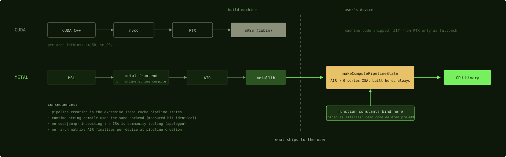

# Compilation Pipeline

**MSL source compiles to AIR (portable IR), AIR ships in a metallib, and the GPU
binary is generated when you build a pipeline state on the user's machine.**

CUDA equivalent, stage by stage:

| CUDA | Metal | Notes |
|---|---|---|
| CUDA C++ | [MSL](msl.md) | |
| nvcc | `metal` frontend (`xcrun metal`) or runtime compile | |
| PTX | **AIR** (Apple IR, LLVM-bitcode-based) | portable across GPU generations |
| cubin / SASS | GPU binary inside a **pipeline state** | never shipped; always built on-device |
| fatbin / JIT-from-PTX | **metallib** → `MTLLibrary` → `MTLComputePipelineState` | the JIT path is the *only* path |
| `-arch=sm_90` matrix | none needed | AIR finalizes per-device at pipeline creation |

*The dashed line is the ship boundary. CUDA crosses it with machine code;
Metal crosses it with portable IR and finishes compiling on the user's device,
which is what lets function constants participate in the final compile.*

The practical differences from CUDA-land:

**There is no offline path to machine code.** You can compile MSL → metallib ahead
of time (and should, for app startup), but the last mile, AIR → the actual
[G-series ISA](https://github.com/dougallj/applegpu), always happens on-device,
inside `makeComputePipelineState`. Consequences: pipeline creation is the expensive
step (cache pipeline states the way you'd cache cuBLAS handles), and
[function constants](function-constants.md) get to participate in that final
compile, which is what makes them real dead-code elimination rather than runtime
branching.

**Runtime string compilation is a first-class workflow.**
`device.makeLibrary(source:)` compiles an MSL string at runtime through the same
backend as the offline compiler, with measured bit-identical performance
([m5-gemm's README](https://github.com/yaroslavvb/m5-gemm/blob/29414bebb522ddacaa009959f2bcdad9f5b3e5cf/README.md)
tested `-O3 -ffast-math` offline vs runtime: no difference). This is why
[metal-flash-attention generates kernels as Swift strings](../kernels/mfa-codegen.md),
why [MLX JIT-compiles specialized kernels](../mlx/how-an-op-becomes-a-kernel.md),
and why Python harnesses need no Xcode at all.

**Inspecting what the compiler actually emitted is community tooling, not vendor
tooling.** There is no `cuobjdump`. The reverse-engineered
[applegpu](https://github.com/dougallj/applegpu) disassembler is the Godbolt of
this world (`compiler_explorer.py`: MSL in, ISA out), and the standard move when a
kernel underperforms and you suspect [spills](../machine/registers.md) or missed
unrolling. Expect to find one surprise every time you look.

Compile-time configuration arrives through three channels, in decreasing rigidity:
C++ templates (fixed at MSL→AIR time; how [steel](../mlx/steel.md) specializes
shapes), preprocessor `-D` defines (same stage; how
[m5-gemm sets tile sizes](../kernels/gemm-tiled.md)), and
[function constants](function-constants.md) (AIR→binary time; specialization
without recompiling the front half).

Next: [Function constants](function-constants.md)
