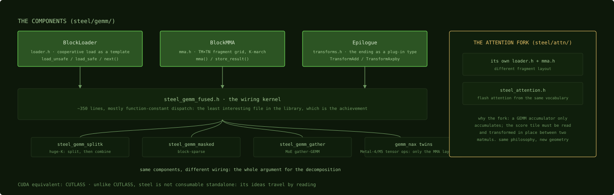

# Steel

**Steel is MLX's kernel library, the CUTLASS of Apple Silicon: GEMM and attention
decomposed into composable C++ templates (`BlockLoader`, `BlockMMA`, epilogues)
that one wiring kernel assembles per shape.**

CUDA equivalent: CUTLASS, faithfully. Same decomposition philosophy, same
"the kernel is just wiring" endgame, adapted to
[simdgroup_matrix](../metal/simdgroup-matrix.md) fragments and
[32 KB threadgroup memory](../machine/threadgroup-memory.md). If you've read
CUTLASS's `Gemm` hierarchy, steel reads like a haiku version of it.

Root: [`mlx/backend/metal/kernels/steel/`](https://github.com/ml-explore/mlx/tree/47bbfe8fa473d6d19037a8d97f1f7d30514e4cf6/mlx/backend/metal/kernels/steel).
The components, each with its own case study:

- **[`BlockLoader`](../kernels/steel-blockloader.md)**
  (`gemm/loader.h`): the [cooperative load](../techniques/cooperative-load.md) as
  a template. It derives each thread's slice of the tile at compile time from the
  threadgroup size, with `load_unsafe` (vectorized, unchecked) and `load_safe`
  (bounds-checked, zero-filled) variants that
  [function constants](../metal/function-constants.md) select between.
- **[`BlockMMA`](../kernels/steel-blockmma.md)** (`gemm/mma.h`): the
  [register-blocked](../techniques/register-blocking.md) multiply. A
  `TM × TN` grid of 8×8 fragments per simdgroup, marched along K.
- **Epilogues** (`gemm/transforms.h`): the ending as a plug-in type
  (`TransformAdd`, `TransformAxpby`), applied while results are
  [still in registers](../techniques/fusion-and-epilogues.md).
- **The wiring kernels** (`gemm/kernels/`):
  [`steel_gemm_fused.h`](../kernels/steel-gemm-fused.md) plus siblings that reuse
  the same components for other shapes: `steel_gemm_splitk.h` (huge-K reductions),
  `steel_gemm_masked.h` (block-sparse), `steel_gemm_gather.h` (MoE gather-GEMM),
  `steel_gemm_segmented.h`.
- **The attention fork** (`attn/`): [flash attention](../kernels/steel-attention.md)
  needs its middle matrix *transformed in place* between two matmuls, so `attn/`
  carries its own `mma.h`/`loader.h` with a different fragment layout. Don't mix
  the two subsystems up when reading.
- **The `_nax` variants** (`gemm_nax.h`, ...): the Metal-4/M5-era tensor-op path.
  Diffing one against its plain sibling shows exactly what the new instruction set
  changes.

*Three components, many wirings. Every sibling kernel at the bottom reuses the
same green boxes; the attention fork on the right is the one place the
geometry itself had to change.*

Which instantiation runs is decided host-side:
[the tile-selection macro](how-an-op-becomes-a-kernel.md) maps chip class and
problem shape to `BM/BN/BK/WM/WN`.

Two facts frame steel's place in the ecosystem. First, **it's the thing to beat,
and it usually wins**: multiple independent projects report hand-written
replacement kernels coming back 0.5-0.8× stock steel
([the failures](../war-stories/the-failures.md)), so the profitable moves are
unlocking its fast paths, not replacing it. Second, **it's not consumable
standalone**: unlike CUTLASS there's no packaged way to use steel outside MLX, so
its ideas travel by reading, which is what this glossary's
[case studies](../kernels/steel-blockloader.md) are for.

Next: [mx.fast](mx-fast.md)
