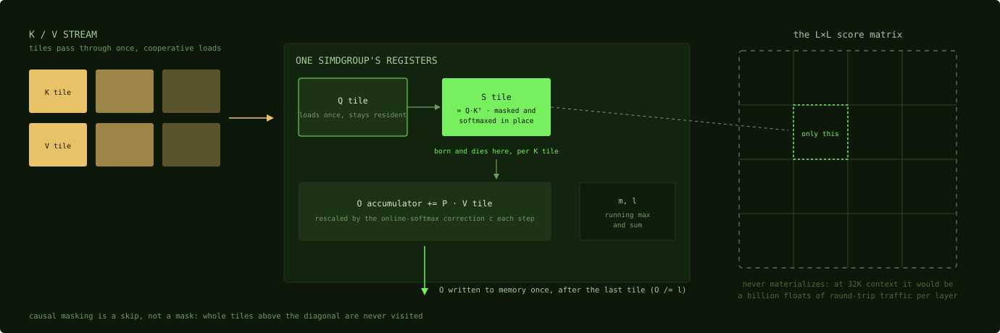

# Flash Attention

**Flash attention computes `softmax(Q·Kᵀ/√d)·V` without ever materializing the
L×L score matrix: streaming K and V in tiles, holding each tile's scores in
[registers](../machine/registers.md), folding contributions into a running output
via [online softmax](online-softmax.md).**

CUDA equivalent: FlashAttention itself; the algorithm is the same. The platform
inflection is *why it matters even more here*. Writing an L×L intermediate to
memory is a [bandwidth](arithmetic-intensity.md) catastrophe on any GPU, but on a
[bandwidth-bound machine](../machine/unified-memory.md) with laptop DRAM it's
disqualifying: at 32K context, the naive intermediate is a billion floats of
round-trip traffic per layer.

The kernel anatomy, common to every implementation (walked line-by-line in the
[MLX case study](../kernels/steel-attention.md)):

1. Q tile loads once and stays; K and V stream past via
   [cooperative loads](cooperative-load.md).
2. `S = Q·Kᵀ` lands in a register tile. The score matrix exists only as one
   simdgroup's [`simdgroup_matrix`](../metal/simdgroup-matrix.md) fragments, is
   masked and softmaxed *in place*, multiplies V, and dies. (This
   transform-in-place requirement is why
   [steel forked its attention `mma.h`](../mlx/steel.md) from the GEMM one.)
3. [Online softmax](online-softmax.md) makes the streaming legal; the
   [base-2 exp path](../machine/special-paths.md) makes it cheap.
4. Causal masking is a *skip*, not a mask, where possible: whole tiles above the
   diagonal [are never visited](../kernels/steel-attention.md).
5. Specialization ([function constants](../metal/function-constants.md), head-dim
   [enumeration](../kernels/llamacpp-attention.md), or
   [codegen](../kernels/mfa-codegen.md)) strips masking/alignment code the shape
   doesn't need.



*The whole trick in one picture: everything green lives in one simdgroup's
registers, everything amber streams through once, and the dashed matrix on the
right is the thing the algorithm exists to avoid writing.*

What to take from the three-implementation comparison
([MLX](../kernels/steel-attention.md) · [MFA](../kernels/mfa-codegen.md) ·
[llama.cpp](../kernels/llamacpp-attention.md)): the algorithm is settled; the
engineering disagreements are where the insight lives. Codegen vs templates vs
enumeration; spill-tolerance vs spill-avoidance; branch-guarded vs unconditional
correction. Same hardware, same math, three defensible kernels.

Boundaries of the technique on this platform, both load-bearing for practice.
**Decode is a different problem**: one query row can't fill an 8×8 tile, so every
implementation ships a separate [vector kernel](decode-vs-prefill.md). **The
backward pass is unfinished business.** MLX's fused attention has no Metal
backward; the entire GPU implementation, verbatim:

```cpp
bool ScaledDotProductAttentionVJP::use_fallback(const array& q, Stream s) {
  return true;
}

void ScaledDotProductAttentionVJP::eval_gpu(
    const std::vector<array>& inputs,
    std::vector<array>& outputs) {
  throw std::runtime_error("NYI");
```
— [MLX `scaled_dot_product_attention.cpp:796-803`](https://github.com/ml-explore/mlx/blob/47bbfe8fa473d6d19037a8d97f1f7d30514e4cf6/mlx/backend/metal/scaled_dot_product_attention.cpp#L796-L803)
(still true on main; training falls back to the
[unfused graph](../mlx/mx-fast.md)). And the one open-source backward
([MFA's split dQ / dK-dV design](../kernels/mfa-codegen.md), forced by
[emulated float atomics](../machine/special-paths.md)) ships in Draw Things, not
in a framework. If you're looking for the ecosystem's most valuable unwritten
kernel, it's this one.

Next: [The KV cache](kv-cache.md)
