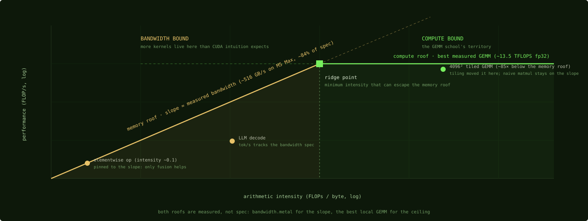

# Roofline

**A roofline is the two-ceiling model (peak bandwidth and peak compute) that
turns a kernel's measured time into a verdict: how far from the physical limit,
and which limit. On a platform [without a profiler](../metal/profiling.md), it's
the primary analysis tool, and you build it yourself.**

CUDA equivalent: the roofline chart Nsight Compute draws for you automatically.
Here you assemble it from two measurements:

**The bandwidth ceiling: measure, don't trust the spec.** A STREAM-style probe
(large buffer copies/reads swept past cache sizes) gives achievable DRAM
bandwidth. The worked example in the case-study codebase,
[m5-gemm's `bandwidth.metal`/`bandwidth.py`](https://github.com/yaroslavvb/m5-gemm/blob/29414bebb522ddacaa009959f2bcdad9f5b3e5cf/bandwidth.py),
measured ~516 GB/s copy on an M5 Max: **~84% of the 614 GB/s spec**, a typical
achievable fraction for unified memory. Use the measured number as your roof;
using the spec quietly inflates every "% of peak" you report.

**The compute ceiling: from the reverse-engineered tables.**
[metal-benchmarks](https://github.com/philipturner/metal-benchmarks)' instruction
throughput tables give per-op ceilings per [core](../machine/gpu-core.md); scale
by core count and clock. For matmul, a shortcut: the best measured GEMM on your
chip class *is* a practical ceiling (13.5 TFLOPS fp32 on a 40-core M5 Max, from
[the case study](../kernels/gemm-tiled.md)).

*The chart the page has been describing. Everything left of the ridge point is
capped by the amber slope no matter how clever the ALU work; everything right
of it answers to the green ceiling. The example points are this glossary's own
recurring cast.*

Then every benchmark result gets the same two-line interrogation: achieved
GFLOPS ÷ compute ceiling, achieved GB/s ÷ bandwidth ceiling. Whichever ratio is
higher names your binding constraint. If both are low, the kernel is
overhead-bound ([dispatch, sync](../metal/command-buffers.md)) or stalled
([spills](../machine/registers.md), [occupancy](../machine/occupancy.md)); go
look at [what the compiler emitted](../metal/compilation-pipeline.md).

Platform-specific hygiene, learned the hard way in the
[war stories](../war-stories/the-failures.md):

- **Thermals are part of the model.** Fanless and laptop chips decay under
  sustained load. One project measured long-run throughput decay dropping from
  50% to 6.7% just by locking fans to max. Report sustained numbers, not
  first-second numbers.
- **The ceilings move with problem size** in ways spec sheets hide: the
  [GEMM ladder's winner flips at three different sizes](../kernels/gemm-double-buffered.md)
  because launch latency, unroll quality, and bandwidth trade dominance. A
  roofline claim without a size sweep is a guess.
- **End-to-end or it didn't happen**: a kernel at 90% of roofline that's 3% of
  runtime buys nothing.
  [Amdahl kills more optimizations here than physics does](../war-stories/the-failures.md).

Next: [Tiling](tiling.md)
