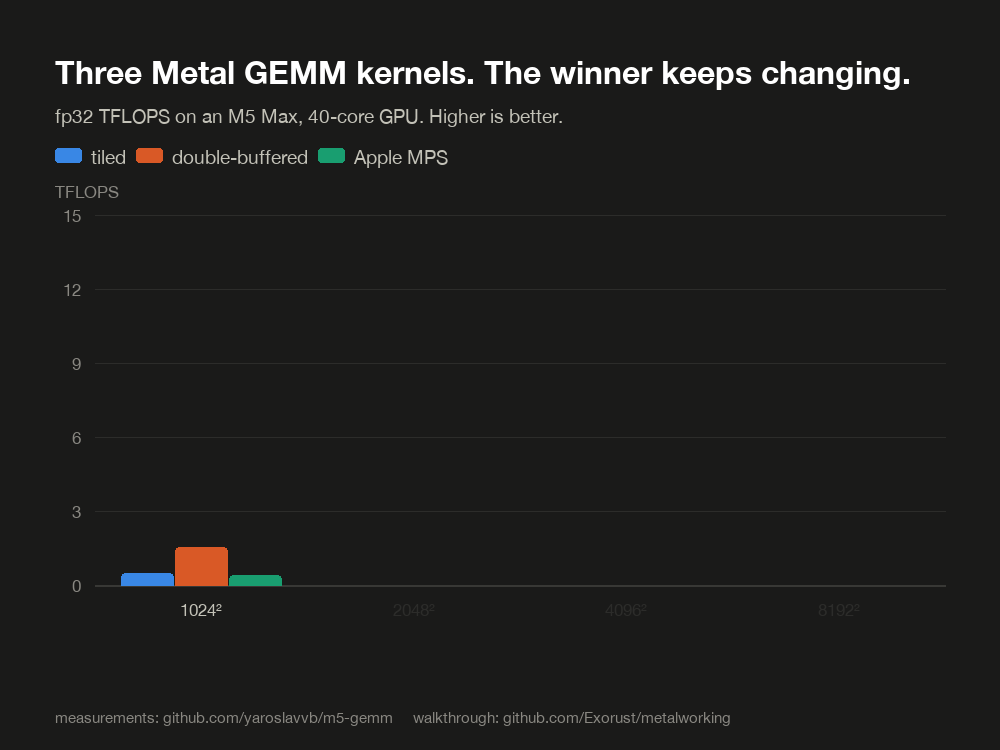

# Stage 2: The GEMM ladder

Needs `code/m5-gemm` and `code/metal-matmul`. Time: the longest stage; take a week.

Every technique that matters in GPU performance work (tiling, threadgroup staging,
register accumulation, latency hiding) shows up in matrix multiply in its purest form.
You'll climb three rungs, each a real kernel you can build and benchmark on your own
machine, ending at ~2.5 TFLOPS fp32 on a fanless MacBook Air, faster than Apple's own
MPS.

Read the companion essay first:
[Fast Multidimensional Matrix Multiplication on Apple GPU](https://percisely.xyz/gemm),
the canonical naive-to-fast Metal GEMM walkthrough, written by the author of
`metal-matmul`.

The punchline of this stage, up front: there is no single fastest kernel. Double
buffering wins at 1024, the simpler single-buffered version wins at 4096, and Apple's
MPS takes it back at 8192 where everything is bandwidth bound. Numbers are from
[m5-gemm's benchmark table](https://github.com/yaroslavvb/m5-gemm) on an M5 Max, not
measured here. Reproduce them on your own machine; that's the exercise.

## Rung 1: naive tiled, single buffered

`code/m5-gemm/sync_copy.metal` is the baseline: cooperative loads into threadgroup
memory, `simdgroup_matrix` accumulation, one tile in flight.

## Rung 2: double buffering

`code/m5-gemm/sync_copy_db.metal` does the same per-simdgroup compute, but the K-loop
loads tile `l+1` while computing tile `l`, using two sets of threadgroup buffers. There
is no async DMA here; this is ILP-based latency hiding, not true compute/copy overlap.

**Diff rung 1 against rung 2.** That diff is the whole lesson: what double buffering
costs (2x threadgroup memory, hence occupancy) and what it buys (loads off the critical
path).

Then read `code/m5-gemm/README.md`, an unusually honest measurement writeup. Line 14 and
19-26 tabulate sync vs double-buffered vs MPS by size: double buffering wins small
(launch/DRAM latency dominates), loses at 4096 (the compiler unrolls the shorter loop
better), and both converge to MPS at 8192 where everything is bandwidth bound. Lines 54
and 84 are the "what actually mattered" notes. This repo is the Metal 4 / M5-era port
(13.5 TFLOPS vs MPS's 11.7).

Roofline companion: `code/m5-gemm/bandwidth.metal` measures your machine's achievable
DRAM bandwidth, so you can judge every GEMM number against the real ceiling instead of
the marketing one.

## Rung 3: real async DMA

`code/metal-matmul/async_copy.metal` is the reference for `simdgroup_async_copy`,
Apple's undocumented DMA intrinsic (the closest thing on Apple silicon to CUDA's
`cp.async`/TMA prologue). The repo hand-declares it via inline AIR assembly:

- line 9: `__metal_simdgroup_async_copy_2d` declared
- line 22: bound to `__asm("air.simdgroup_async_copy_2d.p3i8.p1i8")`
- line 34: wrapped in a typed `simdgroup_async_copy<...>()` template
- lines 103, 108: used in the GEMM K-loop, one event per A/B tile, then
  `simdgroup_event::wait`

A counterintuitive finding from the essay: it's fastest when a single simdgroup does all
the loading. Host side: `code/metal-matmul/matmul.py` (`async_copy_config` at line 41 is
the tile-shape autotune surface); `code/metal-matmul/async_copy.py` is a standalone
microbenchmark isolating async-copy latency.

Toolchain note: the intrinsic no longer compiles on Metal 4. That's why m5-gemm exists,
replacing it with cooperative loads plus double buffering. You're reading rung 3 for the
technique, running rungs 1-2 for the numbers.

## Done when

- You've built and benchmarked both m5-gemm kernels on your machine, against
  `bandwidth.metal`'s roofline.
- You can explain the sync vs double-buffered diff from memory: what's traded, and why
  the winner flips with matrix size.
- You can say what `simdgroup_async_copy` did, why it beat manual loads, and what
  replaced it on current toolchains.
- You beat MPS at at least one matrix size.

Next: [Stage 3: How production factors it](stage-3-steel.md)
